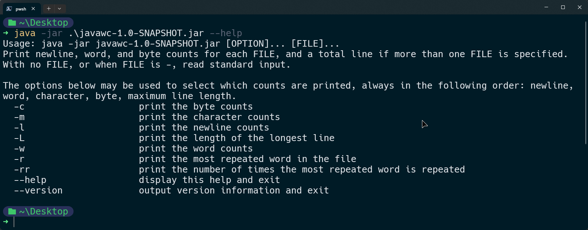
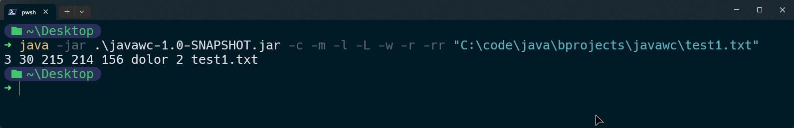

<div align="center">
  <h1 align="center"><a href="https://github.com/ASJordi/javawc">javawc</a></h1>

  <p align="center">javawc command</p>
</div>

## About :computer:

`javawc` is a Java utility designed to replicate the functionality of the well-known Unix command-line tool `wc`. Implements all the features of the original command and adds some extra features.





## Features :sparkles:

- Read from a single file or multiple files
- Read from standard input
- Count the number of:
    - Lines
    - Characters
    - Words
    - Bytes
- Get the longest line
- Get the most repeated word

## Technologies :gear:

- Java 21

## Installation :floppy_disk:

1. Clone the repository
2. Open the project in your favorite IDE
3. Before running the project, make sure to configure arguments in the run configuration
4. Run the project
5. Or build the project with Maven and run the generated jar file

```bash
mvn clean install
```

## Usage :hammer_and_wrench:

```bash
Usage: java -jar javawc-1.0-SNAPSHOT.jar [OPTION]... [FILE]...
Print newline, word, and byte counts for each FILE, and a total line if more than one FILE is specified.
With no FILE, or when FILE is -, read standard input.

The options below may be used to select which counts are printed, always in the following order: newline, word, character, byte, maximum line length.
  -c                     print the byte counts
  -m                     print the character counts
  -l                     print the newline counts
  -L                     print the length of the longest line
  -w                     print the word counts
  -r                     print the most repeated word in the file
  -rr                    print the number of times the most repeated word is repeated
  --help                 display this help and exit
  --version              output version information and exit
```

By default, javawc [FILE] prints newline count, word count, character count and file name. You can customize the output by using the options above.

### Examples :bulb:

- Count the number of words in a file
```bash
java -jar javawc-1.0-SNAPSHOT.jar -w "C:\code\test1.txt"
```

- Count the number of characters in a file
```bash
java -jar javawc-1.0-SNAPSHOT.jar -m "C:\code\test1.txt"
```

- Count the number of bytes, characters, lines, words and the longest line in a file
```bash
java -jar javawc-1.0-SNAPSHOT.jar -c -m -l -w -L "C:\code\test1.txt"
```

## License :page_facing_up:

Distributed under the MIT License. See `LICENSE` for more information.

## Contact :email:

Jordi Ayala - [@ASJordi](https://twitter.com/ASJordi)

Project Link: [https://github.com/ASJordi/javawc](https://github.com/ASJordi/javawc)